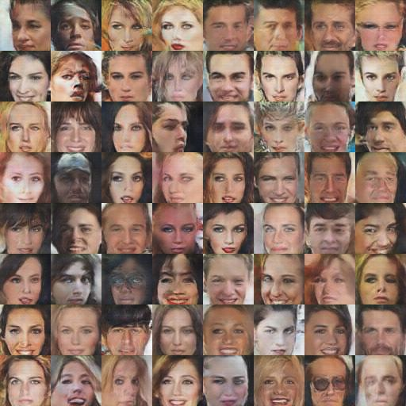

# celebA_DCGAN
## [DCGAN](https://arxiv.org/abs/1511.06434) by Tensorflow 

Result Image (18 epochs)

# Prerequisites
* python3 == 3.6.6
* tensorflow == 1.11.0 +
* tensorlayer == 1.10.1 +
* Scipy

# Usege
[[한국어]](./readme_kr.md)

1. run dl.py in dataset then download celebA datasets
dl.py code from [here](https://github.com/tensorlayer/dcgan/blob/master/download.py)

        $ python3 dl.py celebA 

2. Set [IMAGE_PATH,SAVE_PATH,Thread_core] in "dataset/data_process.py" and run (Crop & Resize)

        $ python3 data_process.py

3. open hyperparameter.py set PATHs
    
        datasets_path = "preprocessed dataPATH (SAVE_PATH/)"
        samples_path = "./samples"
        checkpoint_path = "./ckpt"
        log_path = "./board/log"
    
4. set hyperparameter.py and run train.py

        $ python3 train.py

5. if you want to load ckpt

        load, global_steps = model.load("Put the path here")

6. visualization of training process

        $ tensorboard --logdir ./board

# Model Architecture
## Generator

## Discriminator

### Model Architecture Images From [taeoh-kim's GitHub](https://github.com/taeoh-kim/Pytorch_DCGAN)

# Result

### Images for each 500 step