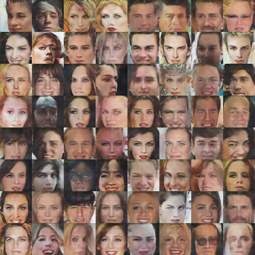

# celebA_DCGAN
## [DCGAN](https://arxiv.org/abs/1511.06434) by Tensorflow

Result Image (18 epochs)

# Prerequisites
* python3 == 3.6.6
* tensorflow == 1.11.0 +
* tensorlayer == 1.10.1 +
* Scipy

# Usege

1. dl.py 를 실행시켜 celebA datasets를 다운로드 합니다
dl.py code from [here](https://github.com/tensorlayer/dcgan/blob/master/download.py)

        $ python3 dl.py celebA 

2. 학습전 데이터를 먼저 처리 하기위해서 "dataset/data_process.py" 를 열어 [IMAGE_PATH,SAVE_PATH,Thread_core] 를 설정해 데이터셋의 경로를 지정하고 cpu 코어수를 입력한다음 **data_process.py** 를 실행시킵니다. 파일수가 있기 때문에 시간이 걸립니다... 

        $ python3 data_process.py

3. hyperparameter.py 열어서 경로를 환경에 맞게 설정합니다.
    
        datasets_path = "전처리된 데이터 경로를 입력하시면 됩니다."
        samples_path = "./samples"
        checkpoint_path = "./ckpt"
        log_path = "./board/log"
    
4. hyperparameter.py 에서 하이퍼파라미터를 설정하시고 train.py 를 실행시켜 학습을 진행시켜주시면 됩니다.

        $ python3 train.py

5. ckpt(체크포인트) 값을 불러오기위해선 train.py 를 열어 원하시는 체크포인트 경로를 입력시켜주시면 됩니다. 예를 들어 model.load(**"./ckpt/DCGAN.ckpt-76500"**) 식으로 입력 해주시면 됩니다. 

        load, global_steps = model.load("Put the path here")
        

6. 학습과정을 텐서보드로 확인하시고 싶으면 **"./board"** 를 경로값으로 입력하시면 됩니다. 

        $ tensorboard --logdir ./board

# Model Architecture
## Generator

## Discriminator

### Model Architecture Images From [taeoh-kim's GitHub](https://github.com/taeoh-kim/Pytorch_DCGAN)

# Result

### Images for each 500 step

# Problem
지금 값으로는 펴균 20 epoch 언저리에서 "모드붕괴" 현상이 확실하게... 일어납니다. ㅠ
가끔 학습 중간 짧게 일어 났습니다. 학습중 D_loss 값이 1e-2 이하로 떨어져서 몇번 지나면 복구가 안될정도 였습니다.

gif 파일을 보시면 학습중간 스텝에서 전부 노이즈가 되었다가 다시 돌아오는걸 확인할수 있습니다.

고쳐보려고 하는데 뭐가 문제인지를 모르고 있습니다... 

## Things I've tried
***

1. 학습률을  4e-5 으로 줄이고 epoch을 100으로 주고 학습을 시도해 봤는데 60~70 중간에 또 모드붕괴 현상이 일어나는걸 확인했습니다. (3번 돌렸는데 2번은 60 , 1번은 68-69 쯤에서 붕괴되어 버려서 로스값이 쭉 올라가버립니다.)

2. Generator_model 을 2번 학습 시키는 방법으로 3번 학습을 시켜봤는데 역시 13~15 사이에서 붕괴되는걸 확인했습니다...